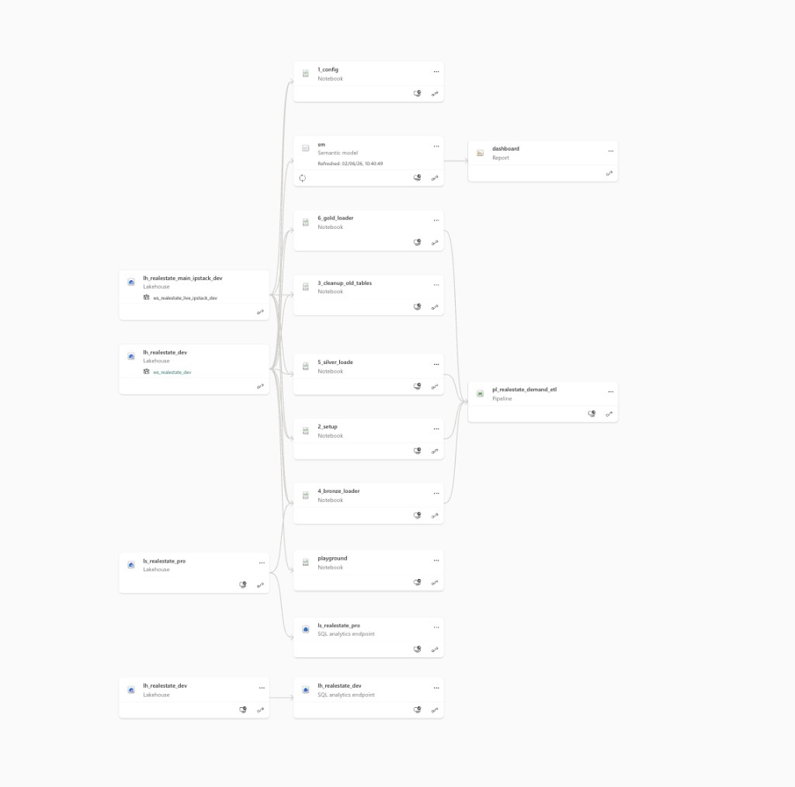
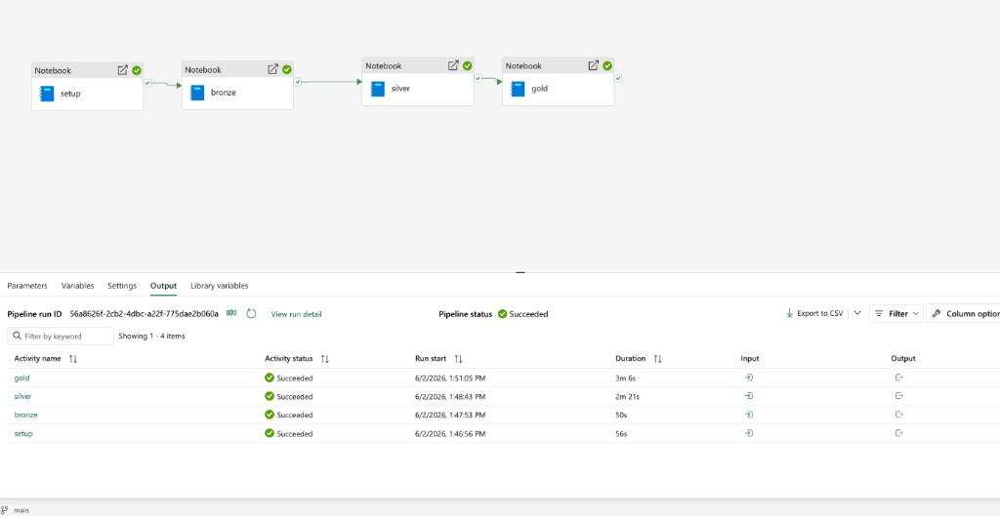
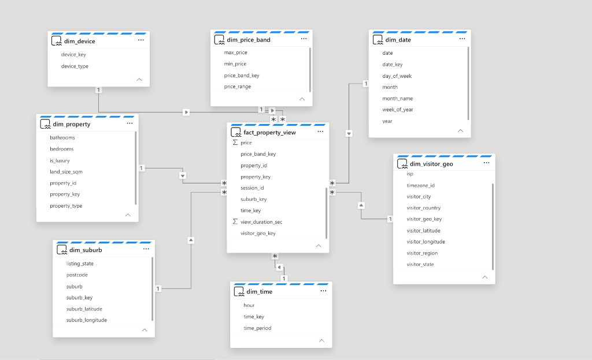
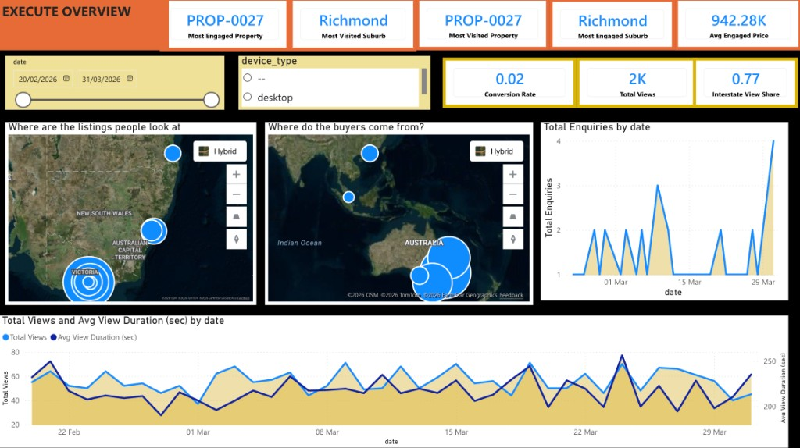
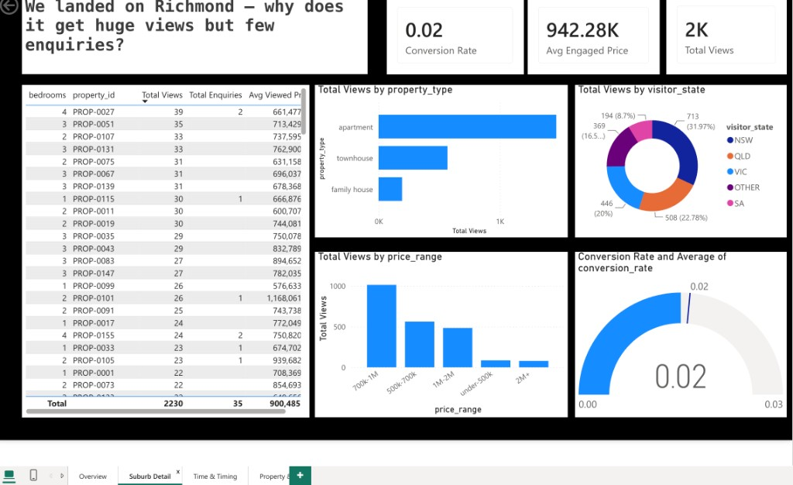
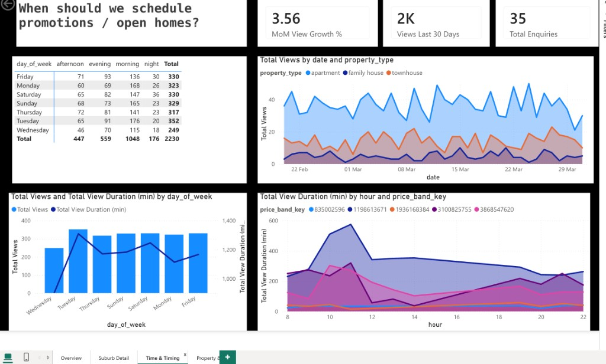

# Real Estate Demand Intelligence Platform (Australia)

# TL;DR

Microsoft Fabric **Bronze → Silver → Gold** pipeline for **Australian real estate agencies**. Combines **property portal events** (views, enquiries) with **IPstack visitor geo enrichment** to answer: *what to promote, in which suburbs, at what price range, and when* — not just page-view dashboards.

## Core business goal

Help an agency decide:

- Which **suburbs** attract interstate / overseas interest  
- Which **property types** and **price ranges** convert best  
- Where **high views but low enquiries** signal a promotion problem  
- Which regions are **trending** month-over-month  

## Architecture

```
listings.csv + property_views.csv (Lakehouse Files)
    → Bronze: listings + views + IPstack raw JSON
    → Silver: silver_visits_enriched (property ⨝ visitor geo)
    → Gold: star schema (fact + dimensions) + decision-support marts
    → Power BI agency briefing
```

| Layer | Tables |
|-------|--------|
| Bronze | `bronze_listings`, `bronze_property_views`, `bronze_ipstack_raw` |
| Silver | `silver_listings`, `silver_ip_dim`, `silver_visits_enriched` |
| Gold (star schema) | `fact_property_view`, `dim_date`, `dim_time`, `dim_property`, `dim_suburb`, `dim_visitor_geo`, `dim_price_band`, `dim_device` |
| Gold (marts) | `gold_suburb_interest`, `gold_conversion_gaps`, `gold_property_trends`, `gold_price_engagement`, and more |

---

## End-to-end (Fabric prod)

### 1. Workspace lineage — Lakehouse → notebooks → pipeline → semantic model → report

Fabric lineage for prod workspace `ws_realestate_pro`: Lakehouse `lh_realestate_pro` feeds PySpark notebooks, orchestrated by `pl_realestate_demand_etl`, into semantic model `sm` and Power BI report `dashboard`.



### 2. Scheduled ETL — Setup → Bronze → Silver → Gold

Prod pipeline run (all activities succeeded): table setup, CSV ingest, IPstack enrichment, and Gold star schema build.



Deploy steps: [`fabric/cicd.md`](fabric/cicd.md)

### 3. Semantic model — star schema for Power BI

`fact_property_view` at the centre; dimensions for date, time, property, suburb, visitor geo, price band, and device. Supports drill-through filters and map visuals via `visitor_latitude` / `suburb_latitude`.



### 4. Power BI — storytelling dashboard (4 pages)

Report design: [`powerbi/README.md`](powerbi/README.md)

**Page 1 — Overview (the hook)**  
Most visited/engaged suburb and property, interstate view share, buyer-origin vs listing-hotspot maps, enquiry and view trends.



**Page 2 — Suburb detail (drill-through)**  
Example: Richmond — high views, low conversion (0.02). Breakdown by property type, visitor state, and price band.



**Page 3 — Time & timing (drill-through)**  
When to schedule promotions: day-of-week × time-of-day heatmap, views by property type over time, MoM growth.



## What IPstack does (and does not do)

| IPstack provides | Your portal data provides |
|------------------|---------------------------|
| Visitor country, region, city (from IP) | Suburb, price, property type, bedrooms |
| Timezone, ISP | View duration, enquiry, favorite flags |
| VPN/proxy flags | Listing catalog, session behavior |

IPstack does **not** supply property listings or company CRM data.

### Geo coordinate fields

- `dim_visitor_geo` includes `visitor_latitude` and `visitor_longitude` from IPstack for visitor-origin maps.
- `dim_suburb` includes approximate `suburb_latitude` and `suburb_longitude` for listing-suburb maps.

## Notebooks (Fabric / PySpark)

| # | Notebook | Purpose |
|---|----------|---------|
| 1 | `1_config.ipynb` | dev/test/prod, lakehouse, mock IPstack |
| 2 | `2_setup.ipynb` | Create Delta tables |
| 3 | `3_cleanup_old_tables.ipynb` | 90-day retention |
| 4 | `4_bronze_loader.ipynb` | Ingest listings + property views |
| 5 | `5_silver_loader.ipynb` | IPstack on visitor IP + enrich joins |
| 6 | `6_gold_loader.ipynb` | Build 8 Gold analytics tables |

## Sample data (synthetic POC)

| File | Rows | Seeded stories |
|------|------|----------------|
| `data/sample/listings.csv` | 160 | VIC/NSW/QLD suburbs, luxury flags |
| `data/sample/property_views_500.csv` | 500 | Optional quick smoke test |
| `data/sample/property_views_5k.csv` | 5,000 | Default Fabric demo + trends |
| `data/fixtures/ipstack/` | 22 IPs | Sydney, Melbourne, Brisbane, SG, HK |

**Seeded analytics stories:** Richmond (high views / low conversion), Box Hill interstate townhouse interest, overseas luxury views, repeat session intent.

Regenerate: `python3 scripts/generate_sample_data.py`

## Quick start (Fabric)

1. Create lakehouse `lh_realestate_dev` and attach to notebooks.
2. Upload `data/sample/listings.csv` and `property_views_5k.csv` → `Files/raw/sample/`.
3. Upload `data/fixtures/ipstack/*.json` → `Files/fixtures/ipstack/`.
4. Open each notebook and run cells top-to-bottom: `2_setup` → `4_bronze` → `5_silver` (`MOCK_IPSTACK=True`) → `6_gold`.
5. Build Power BI from Gold tables — see [`powerbi/README.md`](powerbi/README.md).

## Parameters

| Parameter | Default (dev) | Description |
|-----------|---------------|-------------|
| ENV | dev | dev \| test \| prod |
| LOOKBACK_DAYS | 90 | View history window |
| MOCK_IPSTACK | true | Use fixture JSON for visitor IPs |
| VIEWS_FILE | property_views_5k.csv | Views CSV filename |
| MAX_IPSTACK_CALLS | 5 | Live API safety cap |
| FORCE_REFRESH_IPSTACK | false | Re-call IPstack even when cache exists |
| KEY_VAULT_NAME | blank | Azure Key Vault name or URI for live IPstack |
| IPSTACK_SECRET_NAME | ipstack-access-key | Secret name containing the IPstack key |


## IPstack Modes

Development should normally use mock mode:

```python
MOCK_IPSTACK = True
```

This reads fixture JSON from `Files/fixtures/ipstack/` and keeps runs deterministic.

For a live API smoke test in `feature/live-ipstack-controls`:

```python
MOCK_IPSTACK = False
MAX_IPSTACK_CALLS = 5
FORCE_REFRESH_IPSTACK = False
KEY_VAULT_NAME = "kv-ipstack"
IPSTACK_SECRET_NAME = "ipstack-access-key"
IPSTACK_ACCESS_KEY = ""  # local fallback only; never commit a real key
```

Live mode skips IPs already present in `silver_ip_dim` unless `FORCE_REFRESH_IPSTACK=True`. The safety cap prevents burning API quota during testing. See [`fabric/key_vault_live_ipstack.md`](fabric/key_vault_live_ipstack.md) for Azure Key Vault + pipeline setup.

## Environments

See [`config/environments.yaml`](config/environments.yaml). For branch strategy, prod deploy, and Fabric ↔ Azure DevOps workflow, see [`fabric/cicd.md`](fabric/cicd.md).

## Phase 2

- Notebook/API ingest from real portal instead of CSV  
- Hour-of-day engagement Gold table  
- Optional Kafka for live property views  

## License

MIT
